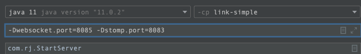

# link
link是一个基于netty，websocket+stomp协议构建的端到端的消息通信，消息订阅工具及SDK;

## 介绍
借助于link，可以轻松实现聊天、订阅发布、消息指令等等实时功能。

## 效果
* 场景1.实时聊天及消息订阅。eg:用户1与用户2之间的聊天对话。
用户1连接服务，建立通信频道channel，用户2连接服务，进入相同频道channel；效果如下：

)

* 场景2.指令发布。eg:手机端语音发送指令，WEB端接受指令执行指令对应的操作。
手机端扫码获取服务地址建立连接，通过ASR语音识别指令并发送，WEB端接受指令，识别后即可执行对应操作；效果如下：

## 启动
启动类：module:link-simple中配置stomp的端口，main函数中启动。

## 功能

* [x] 1.连接
* [x] 2.通信
* [x] 3.订阅发布
* [ ] 4.鉴权
* [ ]  5.心跳
* [ ] 6.缓存
* [ ] 7.消息队列中间件
* [ ] 8.数据库

## 相关
* Netty
* [Stomp](https://ignorantshr.github.io/person-blog/%E5%85%B6%E5%AE%83/Stomp%E5%8D%8F%E8%AE%AE/)